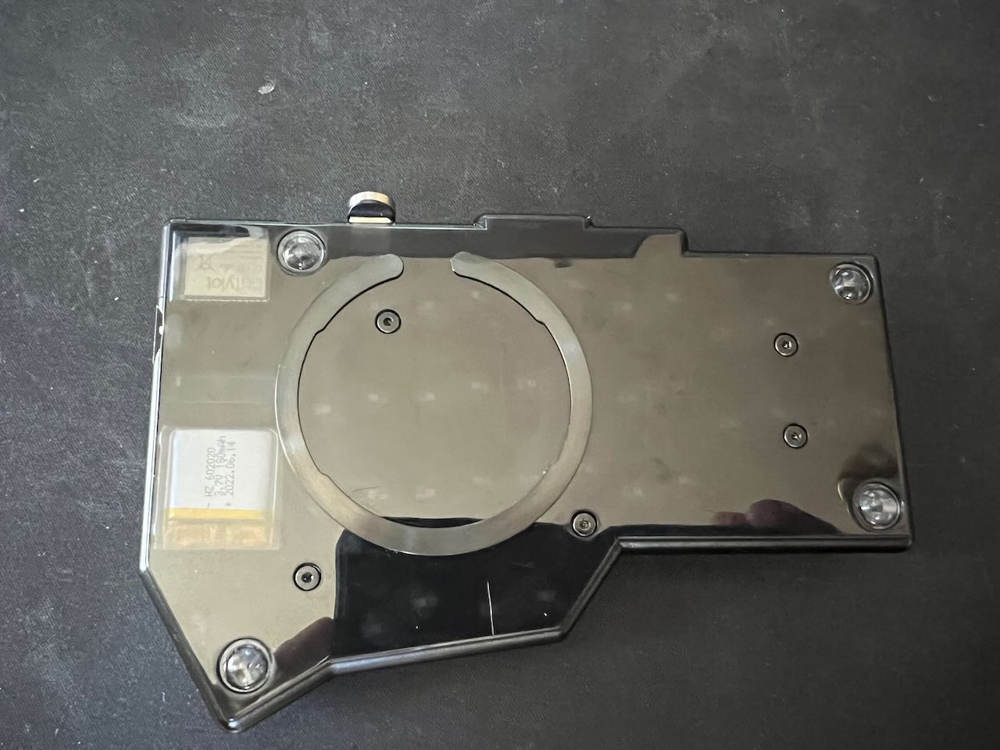
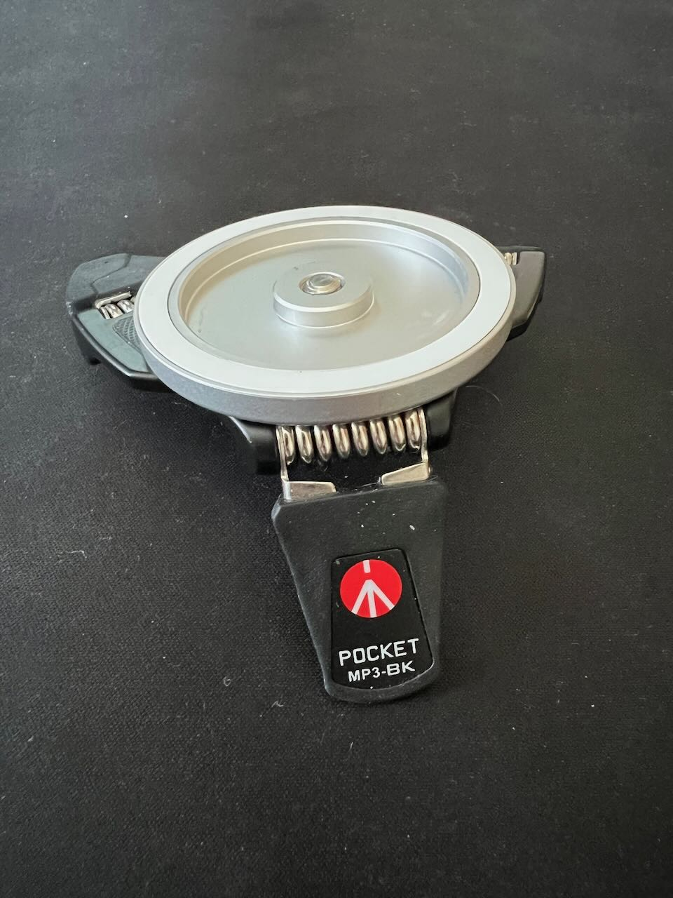
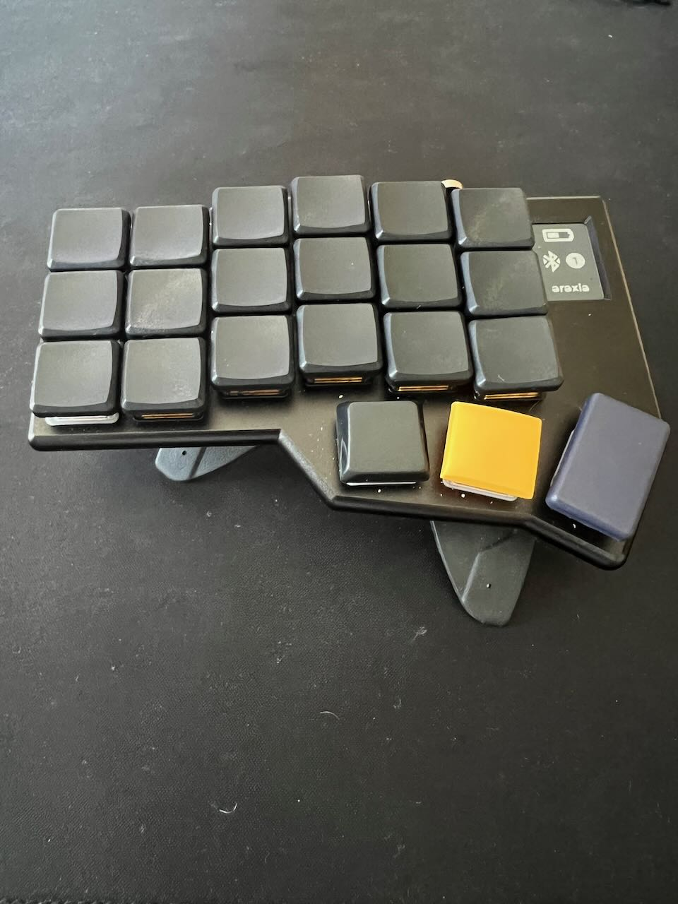
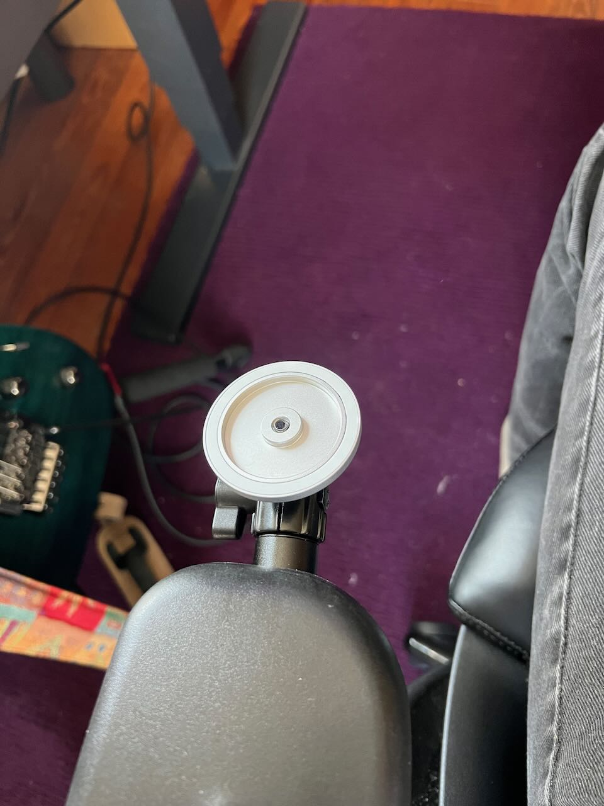
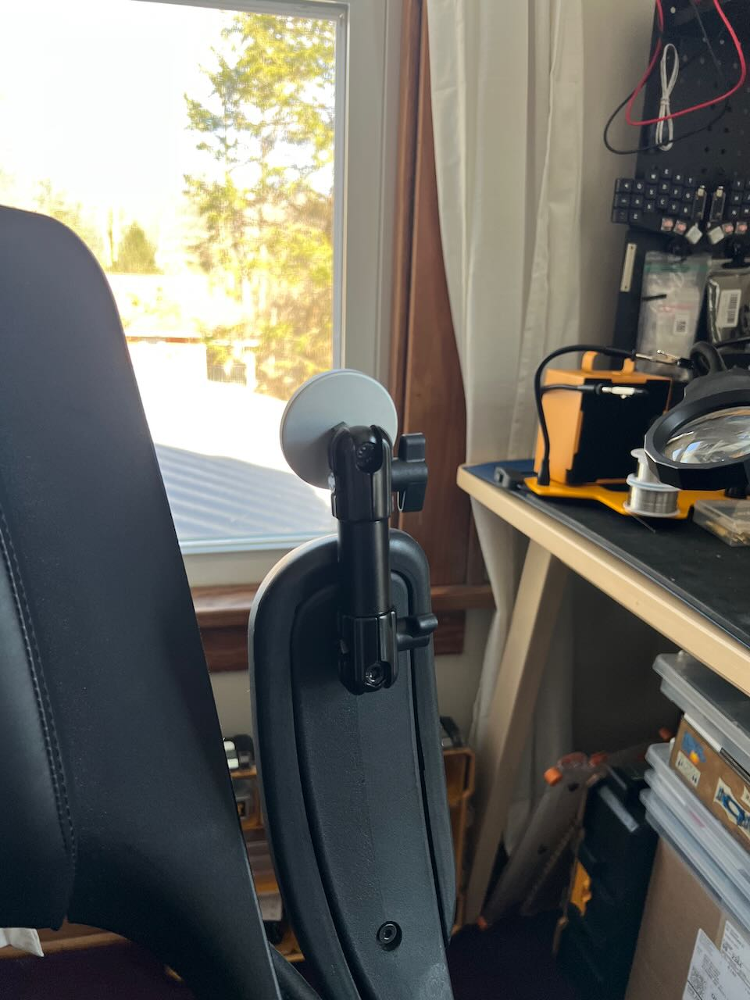
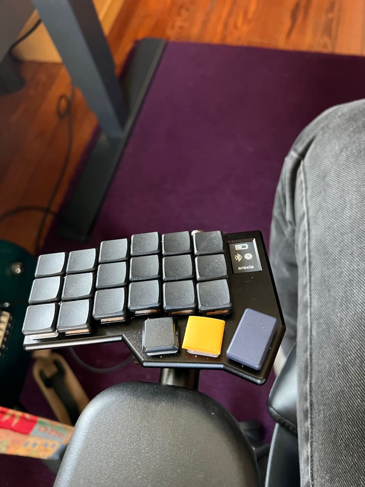
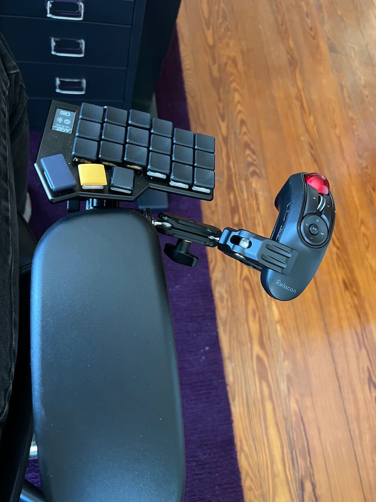

## Magnetic Keyboard Mounting/Tenting

### Parts
- [MagSafe continuity camera mount](https://www.amazon.com/dp/B0BRKPVPQR) (2 @ $15) which has a standard 1/4"-20 thread compatible with camera rigging gear (also available in a [black anodized version](https://www.amazon.com/dp/B0BPLW4ZTZ) ($25)).
- [MagSafe ferromagnetic rings](https://www.amazon.com/dp/B09LQLZKSD) (4 @ $17) with adhesive backs that can be fixed to the bottom case of your keyboard halves. Beware cheap versions of these rings.
- [Manfrotto pocket tripods](https://splitkb.com/collections/keyboard-parts/products/manfrotto-pocket-tripod?variant=39254223814733) (2 @ $30) for standalone tenting ([Amazon link](https://www.amazon.com/Manfrotto-MP3-BK-Large-Pocket-Support/dp/B00HCAB8MU/)). Some people prefer these [Z-style tripods](https://www.amazon.com/dp/B07MHJ2TL6/) ($15).
- [articulated arms](https://www.tackform.com/products/4-75-stud-arm-dual-20mm-ball-couplers-enduro-series) (price varies depending on parts required; budget around $25-50) for mounting to other things, e.g. chair armrests.
- [pinch bolt ball mounts](https://www.tackform.com/products/20mm-aluminum-ball-1-4-20-6mm-thru-hole-25mm-height-enduro-series?variant=18305827799091) (2 @ $13) to attach articulated arms to armrests.
- [ball mounts](https://www.tackform.com/products/enduro-20mm-ball-to-cam-screw?_pos=7&_sid=80f616233&_ss=r) (2 @ $13) to hold and position camera mount.
- [handheld track ball](https://www.amazon.com/ELECOM-Trackball-Connection-Symmetory-Grip-Performance/dp/B08GSCC8RX) ($60) to avoid having to reach too far for tasks requiring heavy GUI interaction.
- [clamp mount](https://www.amazon.com/ULANZI-Camera-Monitor-Ballhead-Adapter/dp/B09W8KG7K7) ($19) to hold the trackball.

### Keyboard Preparation
Stick a ferromagnetic ring to the bottom of each keyboard half, choosing a spot where the weight is balanced, but avoiding any screws. If the magnetic mount cannot rest flush against the ring, this can significantly reduce the strength of the magnetic connection. Be sure the surface is clean, dry, and even before applying the ring. With an incorrectly prepared surface or with cheaper versions of the rings, the adhesive can pull off before the magnet does, and you'll have to pry the ring off your mount and do something rash like superglue it to your case instead.

### Tripod Tenting
The tripod attaches to the continuity camera mount and the keyboard with ferromagnetic ring attaches to it. Adjust the angle with the tripod legs. Rotate the keyboard on the ring; the magnets are strong enough to keep it from moving inadvertently, but not so strong that you can't easily rotate it deliberately.

### Chair Mount
Attach an articulated arm to each armrest (this could be challenging or easy depending on your chair). Attach a continuity camera mount to the pole of each 20mm ball. Attach keyboard halves to mounts. Adjust angle with ball and socket joint. Rotate keyboard halves on rings.

My chair is an [all33 Axion](https://all33.com/products/backstrong-chair) that uses M6 bolts to attach the armrests to the chair, so I was able to swap out the frontmost bolt with a slightly longer one to easily accommodate the Tackform pinch bolt ball mount, which allowed me to attach the articulated arm.

I used the clamp mount attached to the pole of the articulated arm to hold the trackball on the right side, close enough to be convenient but far enough to prevent interference with typing.

### Keyboard Details

The keyboard in the photos is a black anodized [Corne-ish Zen](https://lowprokb.ca/collections/keyboards/products/corne-ish-zen) with a mix of Kailh Pink Choc and [Sunset Choc](https://lowprokb.ca/products/sunset-tactile-choc-switches?pr_prod_strat=use_description&pr_rec_id=83b5c9319&pr_rec_pid=7257177358500&pr_ref_pid=6041157894308&pr_seq=uniform) switches, MBK PBT blanks for the alpha keycaps with a variety of different keycaps on the thumb cluster including a pair of [Asymplex Butter Yellow CS Convex 1U keycaps](https://www.asymplex.xyz/product/chicagosteno-convex-caps). Also using the Corne-ish Zen [display improvements compiled by caksoylar](https://gist.github.com/caksoylar/c411313990978e1903c244f03039187a). USB-C slots equipped with versatile [magnetic adapters](https://www.amazon.com/gp/product/B09YNKT2QS/).
